## 第1关：基本测试
根据S-AES算法编写和调试程序，提供GUI解密支持用户交互。输入可以是16bit的数据和16bit的密钥，输出是16bit的密文。

**加密：**

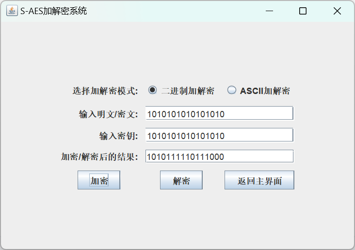

**解密：**

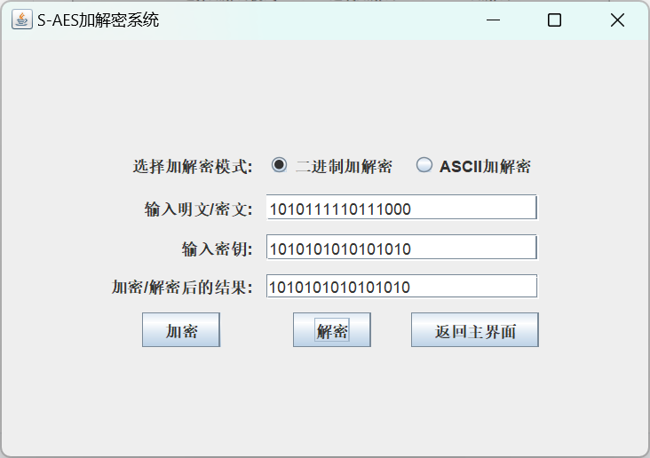

## 第2关：交叉测试
设有A和B两组位同学(选择相同的密钥K)；则A、B组同学编写的程序对明文P进行加密得到相同的密文C；或者B组同学接收到A组程序加密的密文C，使用B组程序进行解密可得到与A相同的P。

**加密：**

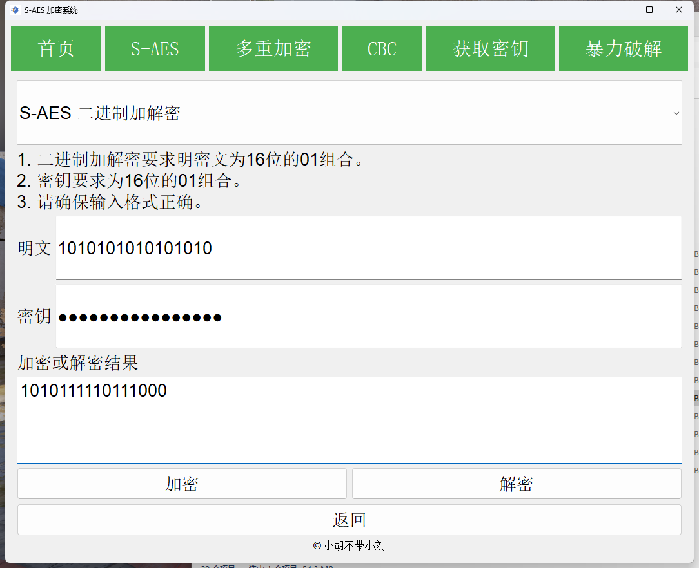

**解密：**

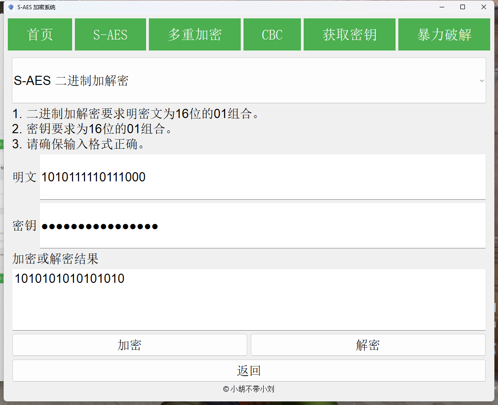

## 第3关：扩展功能
考虑到向实用性扩展，加密算法的数据输入可以是ASII编码字符串(分组为2 Bytes)，对应地输出也可以是ACII字符串(很可能是乱码)。

**加密：**

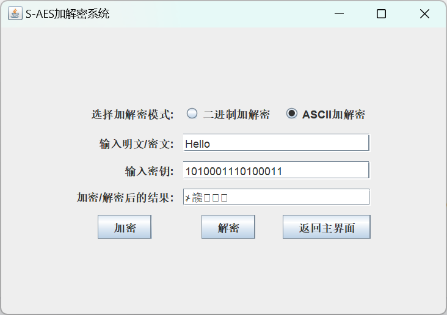

**解密：**

## 第4关：多重加密
### 1、双重加密
将S-AES算法通过双重加密进行扩展，分组长度仍然是16 bits，但密钥长度为32 bits。

**加密：**

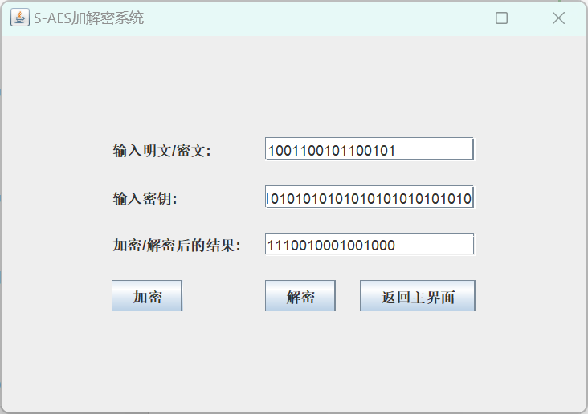

**解密：**

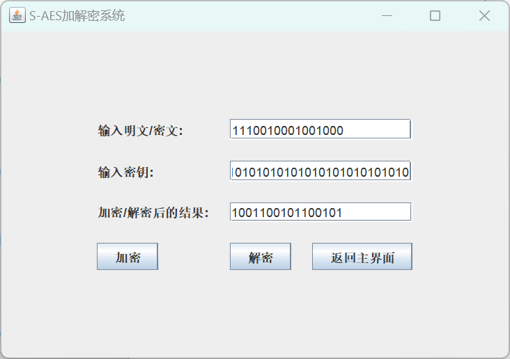

### 2、中间相遇攻击
假设你找到了使用相同密钥的明、密文对(一个或多个)，请尝试使用中间相遇攻击的方法找到正确的密钥Key(K1+K2)。

**中间相遇攻击：**

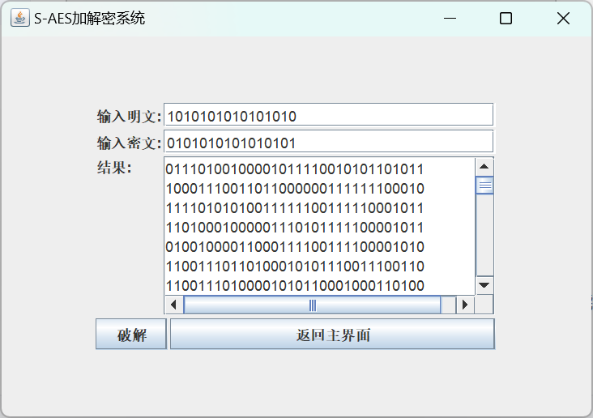

### 3、三重加密
使用48bits(K1+K2+K3)的模式进行三重加解密。

**加密：**

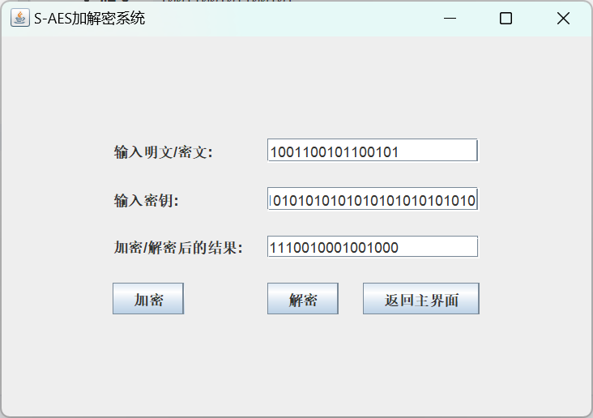

**解密：**

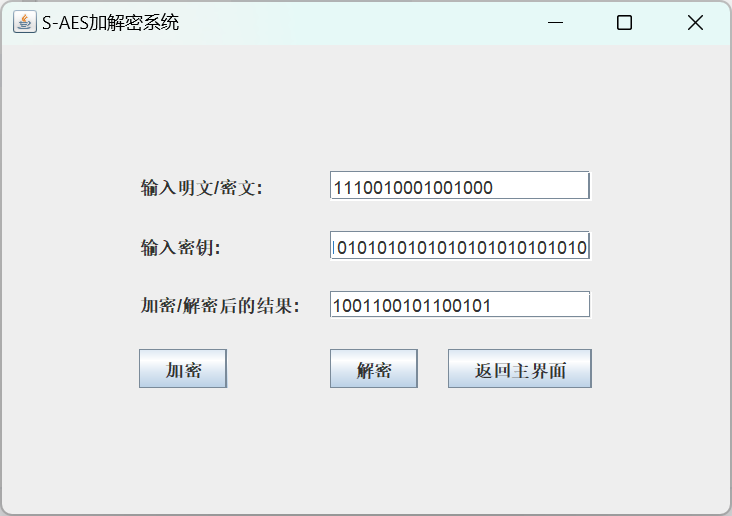

## 第5关：工作模式
基于S-AES算法，使用密码分组链(CBC)模式对较长的明文消息进行加密。注意初始向量(16 bits) 的生成，并需要加解密双方共享。在CBC模式下进行加密，并尝试对密文分组进行替换或修改，然后进行解密，请对比篡改密文前后的解密结果。

**加密：**

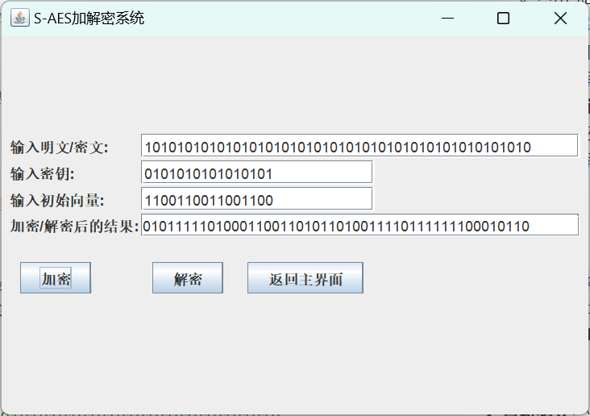

**解密：**

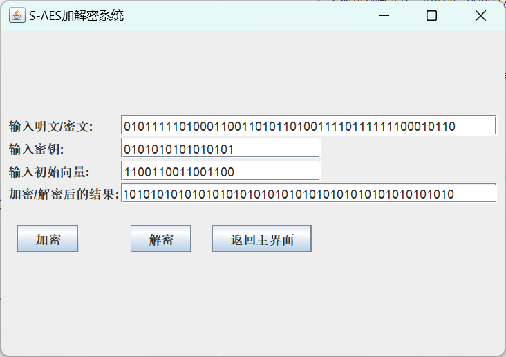

**篡改中间为0000000000000000：**

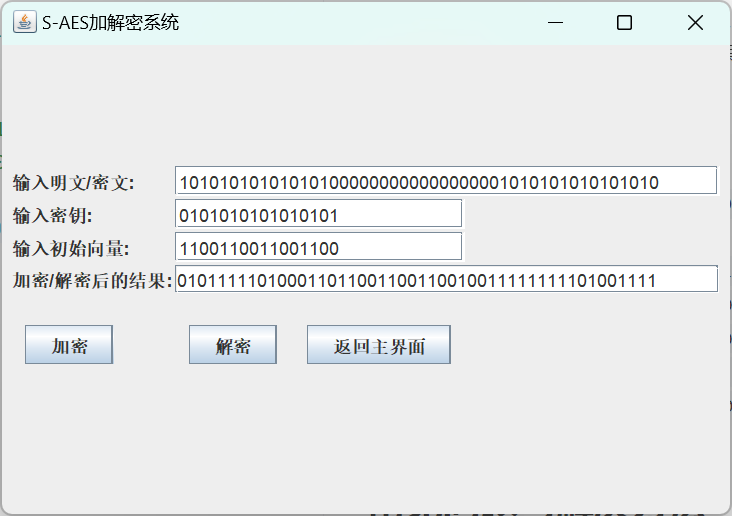
